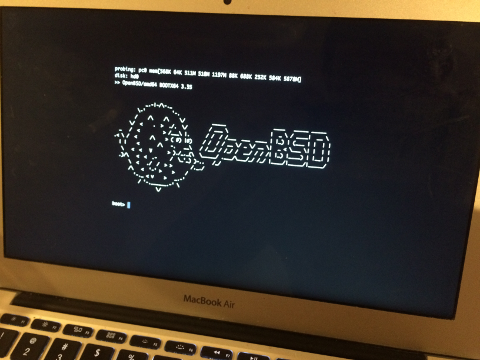

# bsdsplash
Add ascii art splash in OpenBSD bootloader. Configured adding ascii &lt;filename> in /etc/boot.conf  

# disclaimer
The procedure below is not supported, not recommended, not advisable etc.  
The procedure below will replace the bootloader, if you have no idea what these commands are for, you might end up with an unusable (or not recoverable) system. Learn first how to replace the bootloader.
I will not be responsible in any case.

# license
The files are under BSD license (see header in source file).   
The ascii example is taken from:  
http://www.bsdforen.de/threads/ascii-art-puffy.15717/   
My contribution is related to the Xascii function.

# install
- retrieve OpenBSD sources (stable/current) according to  
[https://www.openbsd.org/faq/faq5.html](https://www.openbsd.org/faq/faq5.html)  

- update /usr/src/sys/stand/boot/cmd.c manually
- create boot.conf file in /usr/src/etc
- create arkgate.ascii file in /usr/src/etc
- Add below lines in /usr/src/etc/Makefile under distribution-etc-root-var section
  
  ${INSTALL} -c -o root -g wheel -m 600 boot.conf ${DESTDIR}/etc
  
  ${INSTALL} -c -o root -g wheel -m 600 arkgate.ascii ${DESTDIR}/etc

